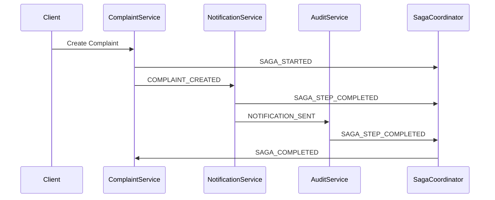
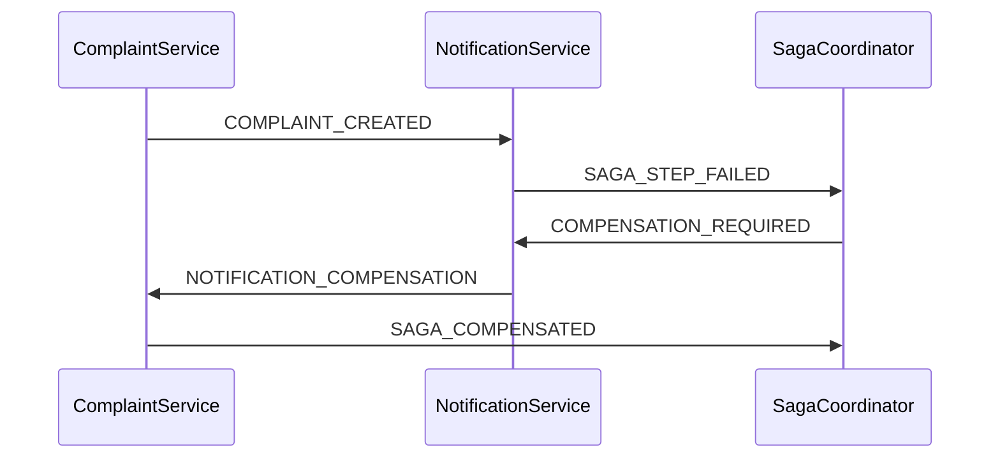

# ADR-011: Coordination des Sagas Chorégraphiées

## Statut

Accepté

## Contexte

L'architecture événementielle nécessite une coordination efficace des transactions distribuées. Nous devons choisir entre l'orchestration centralisée (déjà implémentée) et la chorégraphie distribuée pour gérer les flux métier complexes comme la gestion des plaintes clients.

### Défis de Coordination

1. **Gestion des États Distribués** : Maintenir la cohérence entre services sans état central
2. **Mécanismes de Compensation** : Gérer les échecs partiels et les rollbacks
3. **Traçabilité des Flux** : Suivre l'exécution des sagas sans orchestrateur central
4. **Gestion des Timeouts** : Détecter et gérer les sagas bloquées
5. **Évolutivité** : Permettre l'ajout de nouveaux participants sans modification centrale

### Scénario Métier

Le flux de gestion de plainte implique plusieurs étapes :

1. **Création** : Enregistrement de la plainte
2. **Notification** : Envoi d'accusé de réception
3. **Assignation** : Attribution à un agent
4. **Traitement** : Résolution de la plainte
5. **Audit** : Journalisation complète
6. **Fermeture** : Finalisation avec satisfaction client

## Décision

Nous implémentons des **sagas chorégraphiées** pour la coordination distribuée avec les principes suivants :

### 1. Coordination par Événements

**Principe** : Chaque service réagit aux événements et publie ses propres événements de réponse.

```typescript
// Exemple de chorégraphie
ComplaintService: COMPLAINT_CREATED → 
NotificationService: NOTIFICATION_SENT →
AuditService: AUDIT_LOG_CREATED →
ComplaintService: COMPLAINT_READY_FOR_ASSIGNMENT
```

**Avantages** :

- Découplage maximal entre services
- Pas de point de défaillance unique
- Évolutivité naturelle

### 2. Mécanismes de Compensation

**Événements de Compensation** :

```typescript
interface CompensationRequiredEvent {
  eventType: 'COMPENSATION_REQUIRED';
  eventData: {
    sagaId: string;
    failedStep: string;
    compensationActions: CompensationAction[];
    reason: string;
  };
}

interface CompensationAction {
  service: string;
  action: 'CANCEL' | 'ROLLBACK' | 'NOTIFY';
  parameters: any;
  order: number; // Ordre d'exécution inverse
}
```

**Stratégie de Compensation** :

- Actions compensatoires définies par chaque service
- Exécution en ordre inverse des opérations
- Idempotence garantie pour toutes les actions

### 3. Traçabilité et Corrélation

**IDs de Corrélation** :

```typescript
interface SagaMetadata {
  sagaId: string;           // ID unique de la saga
  correlationId: string;    // ID de corrélation global
  sagaType: string;         // Type de saga (ex: ComplaintHandling)
  initiatingEvent: string;  // Événement déclencheur
  currentStep: string;      // Étape actuelle
  expectedSteps: string[];  // Étapes prévues
}
```

**Propagation** :

- Tous les événements portent les métadonnées de saga
- Traçage de bout en bout via correlation ID
- Monitoring des sagas en cours

### 4. Gestion des Timeouts

**Détection des Sagas Bloquées** :

```typescript
interface SagaTimeoutEvent {
  eventType: 'SAGA_TIMEOUT';
  eventData: {
    sagaId: string;
    lastActivity: Date;
    currentStep: string;
    timeoutDuration: number;
  };
}
```

**Mécanismes** :

- Heartbeat périodique des sagas actives
- Timeout configurable par type de saga
- Actions automatiques en cas de timeout

### 5. État des Sagas

**Suivi d'État Distribué** :

```typescript
interface SagaState {
  sagaId: string;
  sagaType: string;
  status: 'STARTED' | 'IN_PROGRESS' | 'COMPLETED' | 'FAILED' | 'COMPENSATED';
  currentStep: string;
  completedSteps: string[];
  failedSteps: string[];
  startedAt: Date;
  completedAt?: Date;
  compensatedAt?: Date;
}
```

**Persistance** :

- État maintenu dans l'Event Store
- Reconstruction via rejeu d'événements
- Snapshots périodiques pour performance

## Implémentation

### 1. Service de Coordination

**Responsabilités** :

- Suivi de l'état des sagas
- Détection des timeouts
- Déclenchement des compensations
- Métriques et monitoring

**Architecture** :

```typescript
class SagaCoordinator {
  async handleSagaEvent(event: DomainEvent) {
    const sagaState = await this.getSagaState(event.metadata.sagaId);
    
    switch (event.eventType) {
      case 'SAGA_STARTED':
        await this.initializeSaga(event);
        break;
      case 'SAGA_STEP_COMPLETED':
        await this.updateSagaProgress(event, sagaState);
        break;
      case 'SAGA_STEP_FAILED':
        await this.handleSagaFailure(event, sagaState);
        break;
    }
  }
  
  async handleSagaFailure(event: DomainEvent, sagaState: SagaState) {
    const compensationActions = await this.buildCompensationPlan(sagaState);
    
    await this.publishEvent({
      eventType: 'COMPENSATION_REQUIRED',
      eventData: {
        sagaId: sagaState.sagaId,
        compensationActions
      }
    });
  }
}
```

### 2. Participants de Saga

**Interface Standard** :

```typescript
interface SagaParticipant {
  // Traitement normal
  handleBusinessEvent(event: DomainEvent): Promise<void>;
  
  // Compensation
  handleCompensationEvent(event: CompensationEvent): Promise<void>;
  
  // Validation de la capacité à participer
  canParticipateInSaga(sagaType: string): boolean;
}
```

**Exemple d'Implémentation** :

```typescript
class ComplaintService implements SagaParticipant {
  async handleBusinessEvent(event: DomainEvent) {
    switch (event.eventType) {
      case 'COMPLAINT_CREATED':
        await this.processComplaintCreation(event);
        await this.publishSagaEvent('COMPLAINT_PROCESSING_STARTED', event);
        break;
    }
  }
  
  async handleCompensationEvent(event: CompensationEvent) {
    switch (event.eventData.action) {
      case 'CANCEL_COMPLAINT':
        await this.cancelComplaint(event.eventData.complaintId);
        break;
      case 'ROLLBACK_ASSIGNMENT':
        await this.unassignComplaint(event.eventData.complaintId);
        break;
    }
  }
}
```

### 3. Flux de Saga Complète

**Scénario de Succès** :



**Scénario de Compensation** :



## Conséquences

### Avantages

1. **Découplage Maximal**
   - Services indépendants sans dépendances directes
   - Évolution indépendante des participants
   - Résilience aux pannes de services individuels

2. **Scalabilité**
   - Pas de goulot d'étranglement central
   - Parallélisation naturelle des étapes
   - Ajout facile de nouveaux participants

3. **Résilience**
   - Pas de point de défaillance unique
   - Mécanismes de compensation robustes
   - Récupération automatique des échecs

4. **Observabilité**
   - Traçage complet via événements
   - Métriques détaillées par saga
   - Debugging facilité par l'historique d'événements

### Inconvénients

1. **Complexité de Debugging**
   - Flux distribués difficiles à suivre
   - Gestion d'état complexe
   - Corrélation d'événements nécessaire

2. **Cohérence Éventuelle**
   - Pas de cohérence immédiate
   - Gestion des états intermédiaires
   - Complexité de la réconciliation

3. **Gestion des Erreurs**
   - Logique de compensation complexe
   - Gestion des échecs partiels
   - Timeouts et détection de blocages

### Risques et Mitigations

**Risque : Sagas Infinies**

- *Mitigation* : Timeouts configurables, détection de cycles

**Risque : Compensation Incomplète**

- *Mitigation* : Actions idempotentes, vérification de cohérence

**Risque : Performance**

- *Mitigation* : Optimisation des événements, snapshots d'état

## Monitoring et Métriques

### Métriques Clés

```typescript
// Métriques Prometheus
saga_started_total{saga_type}
saga_completed_total{saga_type, status}
saga_duration_seconds{saga_type}
saga_step_duration_seconds{saga_type, step}
saga_compensation_total{saga_type, reason}
```

### Dashboards Grafana

1. **Vue d'Ensemble des Sagas**
   - Sagas actives par type
   - Taux de succès/échec
   - Durée moyenne d'exécution

2. **Détail par Type de Saga**
   - Progression des étapes
   - Points de blocage fréquents
   - Patterns de compensation

3. **Alerting**
   - Sagas bloquées > 5 minutes
   - Taux d'échec > 5%
   - Compensations fréquentes

## Alternatives Considérées

### 1. Orchestration Centralisée

- **Avantage** : Contrôle centralisé, debugging simple
- **Inconvénient** : Point de défaillance unique, couplage
- **Décision** : Gardé pour les flux simples, chorégraphie pour les flux complexes

### 2. Saga Pattern avec State Machine

- **Avantage** : État explicite, transitions claires
- **Inconvénient** : Complexité de configuration, moins flexible
- **Décision** : Chorégraphie plus adaptée à notre architecture événementielle

### 3. Workflow Engines (Temporal, Zeebe)

- **Avantage** : Outils spécialisés, fonctionnalités avancées
- **Inconvénient** : Dépendance externe, courbe d'apprentissage
- **Décision** : Solution custom plus adaptée à nos besoins spécifiques
